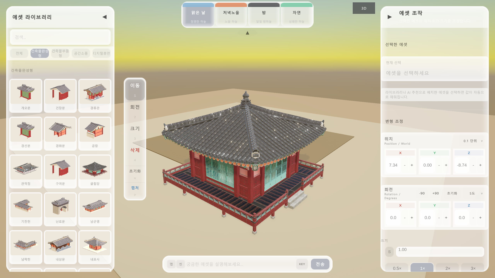

# HanokBuilder — 사용자 가이드

<p align="center">
  
  
  
  
  
  
</p>

<p align="center">
  
</p>

한국 전통 건축 공간을 3D로 직접 조립하고 편집하는 인터랙티브 제작 도구 **HanokBuilder**의 공식 사용자 가이드 사이트입니다.

전문 3D 소프트웨어 지식 없이도 국가 문화공공데이터 기반 에셋을 배치하고, Claude AI로 씬을 구성하며, PNG로 결과를 저장할 수 있습니다.

**Guide** · https://chunbae-a.github.io/HanokBuilder-guide/  
**App** · https://chunbae-a.github.io/Unity-3D_Korean_Traditional_Architecture/

---

## 목차

- [1. 프로젝트 소개](#1-프로젝트-소개)
- [2. 가이드 구성](#2-가이드-구성)
- [3. 주요 기능](#3-주요-기능)
- [4. AI 기능](#4-ai-기능)
- [5. 화면 구성](#5-화면-구성)
- [6. 배경 프리셋](#6-배경-프리셋)
- [7. 편집 도구 및 단축키](#7-편집-도구-및-단축키)
- [8. 기술 스택](#8-기술-스택)
- [9. 로컬 실행](#9-로컬-실행)
- [10. 배포](#10-배포)
- [11. 데이터 출처](#11-데이터-출처)
- [12. 관련 레포지토리](#12-관련-레포지토리)

---

## 1. 프로젝트 소개

### 1.1 HanokBuilder란

HanokBuilder는 Unity 6 기반으로 개발된 한국 전통 건축 공간 3D 제작 도구입니다. 한국문화정보원이 공개한 문화공공데이터를 원천으로 완성형 한옥 건물, 건축 부품, 자연물, 소품, 디지털 휴먼 에셋을 제공하며, WebGL 빌드를 통해 설치 없이 브라우저에서 실행할 수 있습니다.

이 레포지토리는 해당 도구의 공식 사용자 가이드 웹 사이트 소스입니다. 프레임워크 없이 정적 HTML / CSS / JavaScript로 구성되었으며, 설치와 빌드 없이 바로 로컬에서 열어볼 수 있습니다.

### 1.2 활용 대상

| 대상 | 활용 방식 |
| --- | --- |
| 게임 개발자 · 인디 팀 | 한국 전통 배경 씬 프로토타입 레퍼런스 제작 |
| 교육자 · 학생 | 한국 전통 건축 구조 학습 및 시각 자료 제작 |
| 웹툰 · 일러스트 작가 | 전통 공간 구도 참고용 3D 렌더링 캡처 |
| 메타버스 기획자 | 공간 레이아웃 설계 및 검토 |
| 박물관 · 문화기관 | 전통 건축 디지털 아카이브 구성 |

---

## 2. 가이드 구성

가이드는 15개 섹션으로 구성됩니다.

| # | 섹션 | 내용 |
| ---: | --- | --- |
| 1 | 개요 | 기능 카드, 스펙, 활용 대상 |
| 2 | 바로 체험하기 | WebGL 앱 브라우저 임베드 |
| 3 | 화면 구성 | 7개 영역 어노테이션 설명 |
| 4 | 시작 흐름 | 처음 시작하는 5단계 절차 |
| 5 | 배경 프리셋 | 한옥 마당 / 저녁노을 / 밤 / 자연 4가지 |
| 6 | 에셋 라이브러리 | 카테고리 구조, 검색 방법 |
| 7 | 카메라 조작 | 마우스, 키보드, Numpad 시점 전환 |
| 8 | 편집 도구 | 이동 / 회전 / 크기 / 삭제 + 단축키 |
| 9 | 부재 정보 패널 | 위치 · 회전 · 크기 수치 조정 |
| 10 | AI 기능 | 에셋 추천 / AI 자동 레이아웃 / 자연어 씬 편집 |
| 11 | 문화재 해설 | 건물 클릭 시 Claude 해설 생성 |
| 12 | 캡처 | PNG 저장 방법 및 파일 형식 |
| 13 | 단축키 전체 | 편집 / 카메라 / 뷰 전환 탭 |
| 14 | 문제 해결 | 자주 묻는 질문 10가지 |
| 15 | 문화데이터 출처 | 한국문화정보원 공개 데이터 |

---

## 3. 주요 기능

### 3.1 에셋 라이브러리

국가 문화공공데이터 기반의 3D 에셋을 카테고리와 검색으로 탐색합니다. 썸네일을 클릭하면 3D 뷰포트 중앙에 즉시 배치됩니다.

| 분류 | 포함 에셋 |
| --- | --- |
| 완성형 | 봉수당, 사랑채 등 한옥 건물 전체 모델 |
| 부품형 | 보 · 단청 · 장식 · 문 · 바닥 · 난간 · 마루 · 자연물 · 지붕 · 벽 · 목재 |
| 소품 | 장독대 · 물확 · 괴석 · 화분 · 디딤돌 · 저울 · 등롱 |
| 디지털 휴먼 | 조선시대 복식 기반 인물 에셋 |

### 3.2 실시간 3D 편집

| 기능 | 설명 |
| --- | --- |
| 이동 | 마우스 드래그로 레이캐스트 기반 이동. 표면 없으면 Y=0 평면 자동 스냅 |
| 회전 | X(빨강) · Y(초록) · Z(파랑) 3색 링 핸들 드래그 |
| 크기 | 축 방향 큐브 핸들 / 중앙 구형 핸들(균일) / Ctrl + 스크롤 |
| 삭제 | 에셋 클릭 즉시 제거 |
| 되돌리기 | Ctrl+Z 최대 20단계 |
| 복제 | Ctrl+D — 원본에서 오른쪽 2m에 생성 |

### 3.3 PNG 캡처

| 항목 | 내용 |
| --- | --- |
| 저장 위치 | 사용자 바탕화면 |
| 파일명 형식 | `Hanok_yyyyMMdd_HHmmss.png` |
| 포맷 | PNG (무손실) |
| 캡처 범위 | 3D 뷰포트만. UI 패널 및 툴바 제외 |

---

## 4. AI 기능

HanokBuilder는 Claude Haiku 모델 기반 AI 기능 4가지를 제공합니다. 모두 화면 하단 프롬프트 바에서 접근합니다.

### 4.1 프롬프트 바 구조

```
[ 맵 ]  [ 씬 ]  [  입력 필드  ]  [ ⚙ ]  [ 전송 ]
```

| 버튼 | 역할 |
| --- | --- |
| `맵` | AI 자동 레이아웃 모드 전환 |
| `씬` | 자연어 씬 편집 모드 전환 |
| 기본 (토글 없음) | AI 에셋 추천 |
| `⚙` | API 키 설정 패널 |

API 키는 [console.anthropic.com](https://console.anthropic.com)에서 발급(`sk-ant-…`)하며, 첫 실행 시 자동 팝업으로 안내됩니다. 키 없이도 키워드 기반 로컬 추천이 자동 작동합니다.

### 4.2 AI 에셋 추천 (기본 모드)

자연어를 입력하면 Claude가 에셋 카탈로그에서 최대 30개를 추천합니다. 결과는 가로 스크롤 그리드로 표시되며, 클릭 시 즉시 배치됩니다.

| 입력 예시 | 추천 결과 |
| --- | --- |
| `"나무로 둘러싸인 집"` | 수목 · 정자 · 담장 관련 에셋 |
| `"조선 장터 상인과 바구니, 깃발"` | 행상인 · 전통 수레 · 깃발 에셋 |
| `"아치형 대문 주변 풍경"` | 문 · 기와 · 돌담 관련 에셋 |

### 4.3 [맵] AI 자동 레이아웃

테마를 입력하면 Claude가 최대 20턴에 걸쳐 건물과 자연물을 단계적으로 배치하여 완성형 씬을 설계합니다. 배치 후 겹침이 감지되면 자동으로 다른 좌표를 선택합니다.

| 입력 예시 | 설계 결과 |
| --- | --- |
| `"소규모 양반가 안채 배치"` | 건물 2~4개 + 자연물 6~10개 |
| `"사찰 중심 — 주불전, 종루, 소나무"` | 사찰 구조 + 소나무군 |
| `"밀도 높은 조선 시장 번화가"` | 건물 10~14개 + 자연물 12~18개 |
| `"대규모 궁궐 배치"` | 건물 13~18개 + 자연물 15~25개 |

지원 테마: 양반가 · 사찰 · 관아 · 서원 · 시장 · 정원 · 마을

### 4.4 [씬] 자연어 씬 편집

씬에 배치된 오브젝트를 자연어로 직접 수정합니다. 이전 대화를 기억하므로 "그거", "방금 배치한 것" 같은 문맥 표현도 인식합니다.

| 명령 예시 | 동작 |
| --- | --- |
| `"사랑채를 동쪽으로 5m 옮겨줘"` | X축 +5m 이동 |
| `"처마를 45도 회전해줘"` | Y축 45도 회전 |
| `"정자 삭제해줘"` | 오브젝트 제거 |
| `"연못 하나 추가해줘"` | 카메라 중심에 배치 |
| `"그걸 더 북쪽으로 이동해줘"` | 직전 대상 Z축 이동 |

방향 기준: 동쪽 = +X · 서쪽 = −X · 남쪽 = −Z · 북쪽 = +Z

### 4.5 문화재 해설 패널

에셋을 클릭하면 Claude가 해당 건축물의 역사적 배경 · 건축 특징 · 문화적 의미를 담은 3문장 해설을 말풍선 형태로 즉시 생성합니다.

| 상태 | 표시 형태 | 전환 방법 |
| --- | --- | --- |
| Expanded | 건물 위 말풍선 — 제목 · 해설 본문 전체 | 에셋 클릭 시 기본 |
| Collapsed | 작은 pill — "▸ 건물명"만 표시 | `[−]` 버튼 클릭 |
| Hidden | 표시 없음 | `[✕]` 버튼 클릭 |

---

## 5. 화면 구성

실행 화면은 7개 영역으로 나뉩니다.

| 번호 | 영역 | 설명 |
| ---: | --- | --- |
| 1 | 에셋 라이브러리 | 카테고리와 검색으로 에셋 탐색. 썸네일 클릭 시 즉시 배치 |
| 2 | 검색 · 카테고리 필터 | 한글 키워드로 이름 · 태그 즉시 필터링 |
| 3 | 배경 프리셋 패널 | 4가지 배경 원클릭 전환 |
| 4 | 3D 뷰포트 | 에셋을 배치하고 카메라를 조작하는 주 편집 공간 |
| 5 | 편집 도구 툴바 | 이동 · 회전 · 크기 · 삭제 + 캡처 · 초기화 |
| 6 | 부재 정보 패널 | 선택 에셋의 이름 · 위치 · 회전 · 크기 수치 조정 |
| 7 | AI 프롬프트 바 | `[맵]` · `[씬]` 모드 전환 및 자연어 입력 |

---

## 6. 배경 프리셋

화면 상단 중앙 패널에서 전환합니다. 배경이 바뀌어도 배치한 에셋은 유지됩니다.

| 프리셋 | 공간 특징 | 조명 · 환경 | 추천 활용 |
| --- | --- | --- | --- |
| 한옥 마당 (기본) | 조선시대 한옥 마당 분위기 야외 | 주황빛 햇빛, 파란 하늘 | 일반 배치 테스트 |
| 저녁노을 | 노을빛 따뜻한 야외 공간 | 저각도 주황 햇빛, 안개 | 분위기 렌더링 캡처 |
| 밤 (달빛) | 짙은 남색 야간 공간 | 달빛, 달 오브젝트 | 야경 씬 구성 |
| 자연 | 초록 잔디 외부 정원 | 노란빛 햇빛, 자연 환경광 | 자연 요소 배치 |

---

## 7. 편집 도구 및 단축키

### 7.1 편집 도구

| 도구 | 단축키 | 동작 |
| --- | :---: | --- |
| 이동 | `1` | 드래그로 레이캐스트 이동. Y=0 평면 자동 스냅 |
| 회전 | `2` | 3색 링 핸들 드래그 |
| 크기 | `3` | 핸들 드래그 / `Ctrl` + 스크롤 |
| 삭제 | `4` | 클릭 즉시 삭제 |
| 회전 초기화 | `H` | 선택 에셋 회전값 0 복원 |
| 캡처 | `P` | 뷰포트 PNG 저장 |

### 7.2 전체 단축키

| 단축키 | 기능 |
| --- | --- |
| `Ctrl` + `Z` | 되돌리기 (최대 20단계) |
| `Ctrl` + `D` | 선택 에셋 복제 (오른쪽 2m) |
| `F` | 선택 에셋 화면 중앙 포커스 |
| `Z` | 배치된 전체 에셋 프레임 보기 |
| `Numpad 1` | 정면 뷰 (직교) |
| `Numpad 3` | 우측면 뷰 (직교) |
| `Numpad 7` | 탑뷰 (직교) |
| `Numpad 5` / `0` | 원근 뷰 (기본) |
| `Esc` | 선택 해제 |

---

## 8. 기술 스택

### 8.1 가이드 사이트

| 항목 | 내용 |
| --- | --- |
| 마크업 | HTML5 (의미론적 태그, ARIA) |
| 스타일 | CSS3 (CSS 변수 기반 디자인 토큰, 다크 모드 지원) |
| 스크립트 | Vanilla JavaScript (IntersectionObserver, 탭, 아코디언) |
| 배포 | GitHub Actions + GitHub Pages (main 브랜치 push 시 자동 배포) |
| 반응형 | 3단계 브레이크포인트 (1200px / 900px / 560px) |
| 의존성 | 없음 (외부 프레임워크 · 라이브러리 미사용) |

### 8.2 HanokBuilder 앱

| 항목 | 내용 |
| --- | --- |
| 엔진 | Unity 6 (6000.3.16f1) |
| 렌더 파이프라인 | Universal Render Pipeline (URP) |
| 플랫폼 | WebGL (브라우저 실행) |
| AI | Claude Haiku (`claude-haiku-4-5-20251001`) |
| 에셋 원천 | 문화포털 메타버스데이터랩 공개 3D 데이터 |

---

## 9. 로컬 실행

별도 빌드 없이 바로 열 수 있습니다.

```bash
git clone https://github.com/Chunbae-A/HanokBuilder-guide.git
cd HanokBuilder-guide
```

이후 `index.html`을 브라우저에서 직접 열거나, 로컬 서버를 사용합니다.

```bash
# Node.js 환경
npx serve .

# Python 환경
python -m http.server 8080
```

---

## 10. 배포

main 브랜치에 push하면 GitHub Actions가 자동으로 GitHub Pages에 배포합니다. 별도 빌드 없이 루트의 `index.html`을 그대로 서빙합니다.

```yaml
# .github/workflows/deploy-pages.yml
on:
  push:
    branches: [main]
  workflow_dispatch:

jobs:
  deploy:
    runs-on: ubuntu-latest
    environment:
      name: github-pages
    steps:
      - uses: actions/checkout@v4
      - uses: actions/upload-pages-artifact@v3
        with:
          path: .
      - uses: actions/deploy-pages@v4
```

---

## 11. 데이터 출처

에셋 라이브러리는 국가기관이 공개한 문화공공데이터를 원천으로 합니다.

| 데이터 | 제공 기관 | 플랫폼 |
| --- | --- | --- |
| 건축물 완성형 3D 데이터 | 한국문화정보원 | 문화포털 메타버스데이터랩 |
| 건축물 부품형 3D 데이터 | 한국문화정보원 | 문화포털 메타버스데이터랩 |
| 디지털 휴먼 데이터 | 한국문화정보원 | 문화포털 메타버스데이터랩 |
| 공간소품 3D 오브젝트 | 한국문화정보원 | 문화포털 메타버스데이터랩 |

수집한 데이터는 에셋 식별자(`assetKey`), 한글 표시명, 카테고리, 검색 태그로 재구조화하여 라이브러리 검색과 AI 추천에서 동일하게 활용합니다.

---

## 12. 관련 레포지토리

| 레포 | 설명 |
| --- | --- |
| [Unity-3D_Korean_Traditional_Architecture](https://github.com/Chunbae-A/Unity-3D_Korean_Traditional_Architecture) | HanokBuilder Unity 앱 소스 (C# · URP · WebGL 빌드) |
